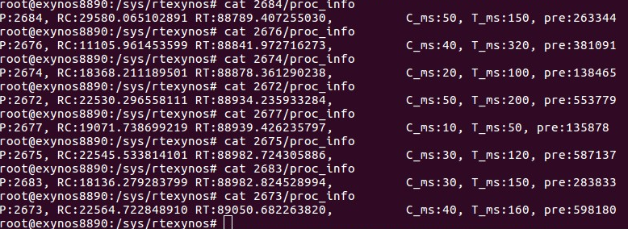

# Rate Monotonic Scheduling in Linux Kernel - Reference Code
###	Author Shobhit Kukreti
	
#### Real Time Abstraction inside the Linux Kernel to make user chosen processes follow a Real Time Schedule based on user provided timing constraints.

The Rate Monotonic Scheduling Policy requires two parameters Worst Case Execution Time (C) and Time Period (T).

The scheduling methodoloy hijacks the context_switch() function to get the struct task_struct *prev, *next pointers to manage the real time scheduling. 

The tasks sets are scheduled per core following Worst Fit Descreasing scheme. 
To schedule a task set, a RT test needs to be employed before setting processor affinity.

P : Process ID 
RC : Total Worst Case Execution Time in ms:ns 
RT : Total Time Period in ms:ns 
pre: Total Context Switches when the process was swapped out or swapped in 
C : Process Worst Case Execution Time 
T : Time Period of the Process 

#### Further work: 
	1. Define Scheduler Class and integrate with Linux Sched Code.
	2. Cleanup the Code. 	
	 

### Note:  Will not compile standalone as a new syscall is added in the kernel to provide the kernel module information such as PID, C and T.

